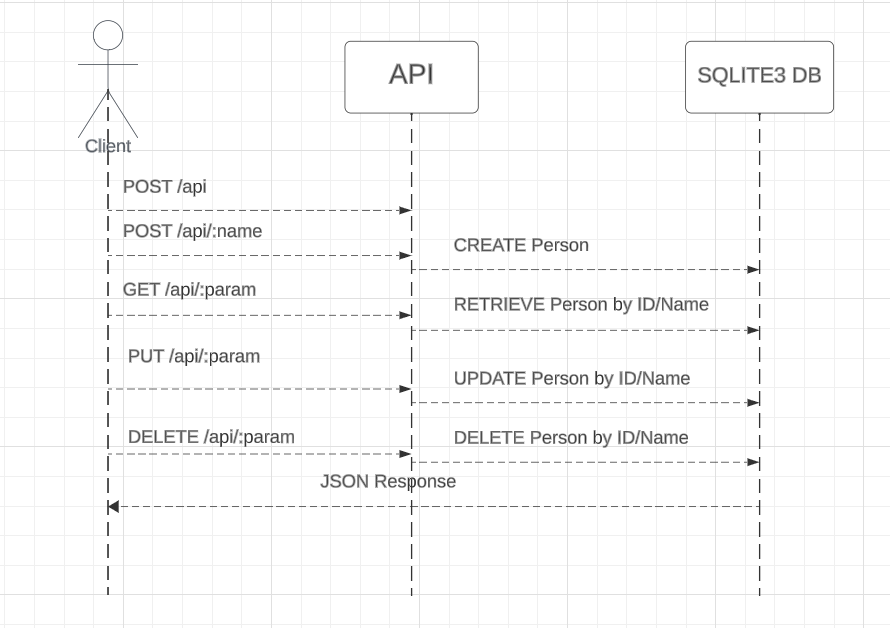

# Person API

This is a simple Django REST API for managing Person objects. It allows you to create, retrieve, update, and delete Person records. The API also includes validation to ensure that only valid data is accepted.



## Table of Contents

- [Prerequisites](#prerequisites)
- [Installation](#installation)
- [Usage](#usage)
  - [Running the Server](#running-the-server)
  - [API Endpoints](#api-endpoints)
- [Testing](#testing)


## Prerequisites

It is assumed you have the following:

- Python 3.10+ installed
- Linux environment

## Installation

1. Clone the repository to your local machine:

```bash
git clone https://github.com/Pythonian/apiendpoint.git
```

2. Navigate to the project directory:

```bash
cd apiendpoint
```

3. Create a virtual environment (optional but recommended):

```bash
python -m venv venv
```

4. Activate the virtual environment:

```bash
source venv/bin/activate
```

5. Install the project dependencies:

```bash
pip install -r requirements.txt
```

## Usage

### Running the Server

1. Apply the database migrations:

```bash
python manage.py migrate
```

2. Start the development server:

```bash
python manage.py runserver
```

By default, the server will run on http://127.0.0.1:8000/. You can access the API endpoints through this URL http://127.0.0.1:8000/api.

### API Endpoints

#### Create a User

- **URL**: `/api`
- **Method**: `POST`
- **Request Body**: JSON object with a `name` field.
  ```json
  {
      "name": "Pythonian"
  }
  ```
- **Response**: Returns a JSON object representing the created user.
  ```json
  {
      "id": 1,
      "name": "Pythonian"
  }
  ```
- **Status Codes**:
  - `201 CREATED` for a successful creation.
  - `400 BAD REQUEST` if the request is invalid (e.g., name already exists).

#### Create a User by Name

- **URL**: `/api/<str:name>`
- **Method**: `POST`
- **Request URL**: _http://127.0.0.1:8000/api/Hablo_
- **Response**: Returns a JSON object representing the created user.
  ```json
  {
      "id": 2,
      "name": "Hablo"
  }
  ```
- **Status Codes**:
  - `201 CREATED` for a successful creation.
  - `409 CONFLICT` if the name already exists.

#### Retrieve a User by ID

- **URL**: `/api/<int:user_id>`
- **Method**: `GET`
- **Request URL**: _http://127.0.0.1:8000/api/1_
- **Response**: Returns a JSON object representing the user with the specified ID.
  ```json
  {
      "id": 1,
      "name": "Pythonian"
  }
  ```
- **Status Codes**:
  - `200 OK` for a successful retrieval.
  - `404 NOT FOUND` if the user with the specified ID does not exist.

#### Update a User by ID

- **URL**: `/api/<int:user_id>`
- **Method**: `PUT`
- **Request URL**: _http://127.0.0.1:8000/api/1_
- **Request Body**: JSON object with a `name` field.
  ```json
  {
      "name": "Prontomaster"
  }
  ```
- **Response**: Returns a JSON object representing the updated user.
  ```json
  {
      "id": 1,
      "name": "Prontomaster"
  }
  ```
- **Status Codes**:
  - `200 OK` for a successful update.
  - `400 BAD REQUEST` if the request is invalid (e.g., empty name).
  - `404 NOT FOUND` if the user with the specified ID does not exist.

#### Delete a User by ID

- **URL**: `/api/<int:user_id>`
- **Method**: `DELETE`
- **Request URL**: _http://127.0.0.1:8000/api/1_
- **Response**: Returns a message confirming the deletion.
  ```json
  {
      "message": "User with ID 1 deleted"
  }
  ```
- **Status Codes**:
  - `200 OK` for a successful deletion.
  - `404 NOT FOUND` if the user with the specified ID does not exist.

#### Retrieve a User by Name

- **URL**: `/api/<str:name>`
- **Method**: `GET`
- **Request URL**: _http://127.0.0.1:8000/api/Prontomaster_
- **Response**: Returns a JSON object representing the user with the specified name.
  ```json
  {
      "id": 1,
      "name": "Prontomaster"
  }
  ```
- **Status Codes**:
  - `200 OK` for a successful retrieval.
  - `404 NOT FOUND` if the user with the specified name does not exist.

#### Update a User by Name

- **URL**: `/api/<str:name>`
- **Method**: `PUT`
- **Request URL**: _http://127.0.0.1:8000/api/Prontomaster_
- **Request Body**: JSON object with a `name` field.
  ```json
  {
      "name": "Pythonian"
  }
  ```
- **Response**: Returns a JSON object representing the updated user.
  ```json
  {
      "id": 1,
      "name": "Pythonian"
  }
  ```
- **Status Codes**:
  - `200 OK` for a successful update.
  - `400 BAD REQUEST` if the request is invalid (e.g., empty name).
  - `404 NOT FOUND` if the user with the specified name does not exist.

#### Delete a User by Name

- **URL**: `/api/<str:name>`
- **Method**: `DELETE`
- **Request URL**: _http://127.0.0.1:8000/api/Pythonian_
- **Response**: Returns a message confirming the deletion.
  ```json
  {
      "message": "The User Pythonian has been deleted"
  }
  ```
- **Status Codes**:
  - `200 OK` for a successful deletion.
  - `404 NOT FOUND` if the user with the specified ID does not exist.


## Testing

To run the tests, use the following command:

```bash
python manage.py test
```
